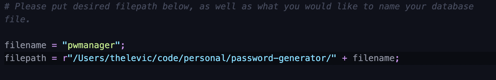

# Password-Generator

---

This is a simple python password generator. It will store your login information in a local sql database. You are able to:

- Create new accounts
- Retrieve your information
- Delete accounts

---

## How to install

1. Clone the repository to desired filepath
2. pip install -r requirements.txt
3. In a terminal environment (cmd, terminal, etc..) please type:
   `python main.py`

---

### How to set up

Please begin by opening up db.py in the lib folder. The only requirement is to add your own filepath to the file as shown below. If you wish, you can also name your database as you please. See image below:

---

### Reporting Errors

Please report errors in the issues section of this github repository. This project is really just for fun.

---

### Requesting Features

Please also submit feature requests into the issues section of this github repository.
